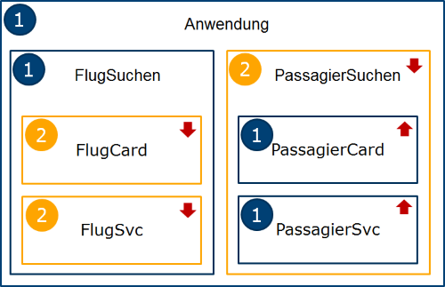

# ngUpgrade-Demo

Dieses Demo zeigt den Einsatz von ngUpgrade. Der Up- und Downgrade erfolgt am Ende der app.ts

Die nachfolgende Übersicht zeigt, wie diese Beispielanwendung Komponenten aus AngularJS 1.x und Angular 2 miteinander kombiniert.

